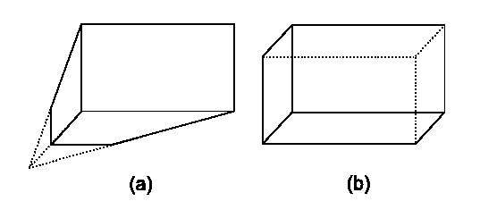
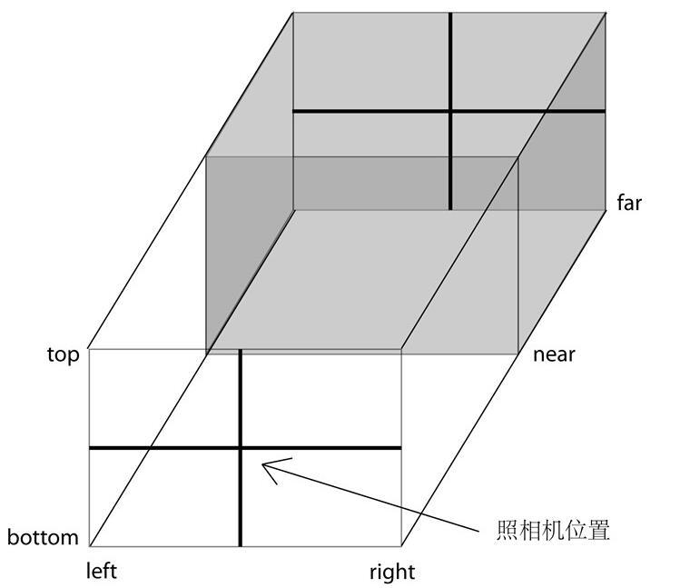

# 至少应该包括四个部分
1. 渲染器(renderer)
2. 场景(scene)
3. 相机(camera)
4. 以及场景中创建的物体

# 重要对象
* Cameras（照相机，控制投影方式）
    * Camera
    * OrthographicCamera
    * PerspectiveCamera

* Core（核心对象）
    * BufferGeometry
    * Clock（用来记录时间）
    * EventDispatcher
    * Face3
    * Face4
    * Geometry
    * Object3D
    * Projector
    * Raycaster（计算鼠标拾取物体时很有用的对象）

* Lights（光照）
    * Light
    * AmbientLight
    * AreaLight
    * DirectionalLight
    * HemisphereLight
    * PointLight
    * SpotLight

* Loaders(加载器，用来加载特定文件)
    * Loader
    * BinaryLoader
    * GeometryLoader
    * ImageLoader
    * JSONLoader
    * LoadingMonitor
    * SceneLoader
    * TextureLoader

* Materials(材质，控制物体的颜色、纹理等)
    * Material
    * LineBasicMaterial
    * LineDashedMaterial
    * MeshBasicMaterial
    * MeshDepthMaterial
    * MeshFaceMaterial
    * MeshLambertMaterial
    * MeshNormalMaterial
    * MeshPhongMaterial
    * ParticleBasicMaterial
    * ParticleCanvasMaterial
    * ParticleDOMMaterial
    * ShaderMaterial
    * SpriteMaterial

* Math(和数学相关的对象)
    * Box2
    * Box3
    * Color
    * Frustum
    * Math
    * Matrix3
    * Matrix4
    * Plane
    * Quaternion
    * Ray
    * Sphere
    * Spline
    * Triangle
    * Vector2
    * Vector3
    * Vector4

* Objects(物体)
    * Bone
    * Line
    * LOD
    * Mesh（网格，最常用的物体）
    * MorphAnimMesh
    * Particle
    * ParticleSystem
    * Ribbon
    * SkinnedMesh
    * Sprite

* Renderers(渲染器，可以渲染到不同对象上)
    * CanvasRenderer
    * WebGLRenderer（使用WebGL渲染，这是本书中最常用的方式）
    * WebGLRenderTarget
    * WebGLRenderTargetCube
    * WebGLShaders（着色器，在最后一章作介绍）

* Renderers / Renderables
    * RenderableFace3
    * RenderableFace4
    * RenderableLine
    * RenderableObject
    * RenderableParticle
    * RenderableVertex

* Scenes（场景）
    * Fog
    * FogExp2
    * Scene

* Textures(纹理)
    * CompressedTexture
    * DataTexture
    * Texture

* Extras
    * FontUtils
    * GeometryUtils
    * ImageUtils
    * SceneUtils

* Extras / Animation
    * Animation
    * AnimationHandler
    * AnimationMorphTarget
    * KeyFrameAnimation

* Extras / Cameras
    * CombinedCamera
    * CubeCamera

* Extras / Core
    * Curve
    * CurvePath
    * Gyroscope
    * Path
    * Shape

* Extras / Geometries（几何形状）
    * CircleGeometry
    * ConvexGeometry
    * CubeGeometry
    * CylinderGeometry
    * ExtrudeGeometry
    * IcosahedronGeometry
    * LatheGeometry
    * OctahedronGeometry
    * ParametricGeometry
    * PlaneGeometry
    * PolyhedronGeometry
    * ShapeGeometry
    * SphereGeometry
    * TetrahedronGeometry
    * TextGeometry
    * TorusGeometry
    * TorusKnotGeometry
    * TubeGeometry

* Extras / Helpers
    * ArrowHelper
    * AxisHelper
    * CameraHelper
    * DirectionalLightHelper
    * HemisphereLightHelper
    * PointLightHelper
    * SpotLightHelper
    
* Extras / Objects
    * ImmediateRenderObject
    * LensFlare
    * MorphBlendMesh

* Extras / Renderers / Plugins
    * DepthPassPlugin
    * LensFlarePlugin
    * ShadowMapPlugin
    * SpritePlugin

* Extras / Shaders
    * ShaderFlares
    * ShaderSprite

# 相机
## 相机类型
1. 正交投影照相机(Orthographic Camera)
    * 对于三维空间内平行的线，投影到二维空间中也一定是平行的(几何课上老师教我们画的效果 图)
    * 对于制图、建模软通常使正交投影，这样不会因为投影而改变物体比例
2. 透视投影照相机
    * 类似人眼在真实世界中看到的有`近大远小`的效果
    * 对于其他大多数应用，通常使用 透视投影，因为这更接近人眼的观察效果 图a
    
> 

## 正交投影照相机
    ```js
    THREE.OrthographicCamera(left, right, top, bottom, near, far)
    ```
* 这六个参数分别代表正交投影照相机拍摄到的空间的六个面的位置，这六个面围成一个长方体，我们称其视景体(Frustum)。
* 只有在视景体内部（下图中的灰色部分）的物体才可能显示在屏幕上，而视景体外的物体会在显示之前被裁减掉。

> 

* 为了保持照相机的横竖比例，需要保证(right - left)与(top - bottom)的比例与Canvas宽度与高度的比例(800/600)一致。
* 页面效果为：后面的边与前面完全重合了，这也就是正交投影与透视投影的区别所在
    * 改变(right - left)与(top - bottom)的比，让它和canvas宽高比不一致，物体会变形[物体会变形](./indx.2.html)
    * 移动相机位置，物体形状不变
    * 相机移动，[物体位置会往相反的方向移动](./indx.3.html)
    * 相机移动到，物体的z轴方向投影以外，展示效果为：[看不到物体](./indx.4.html)


* 原点位置(0,0,0)在canvas的中心点
* 照相机默认是沿着z轴的负方向观察的
    * lookAt函数指定它看着原点方向

